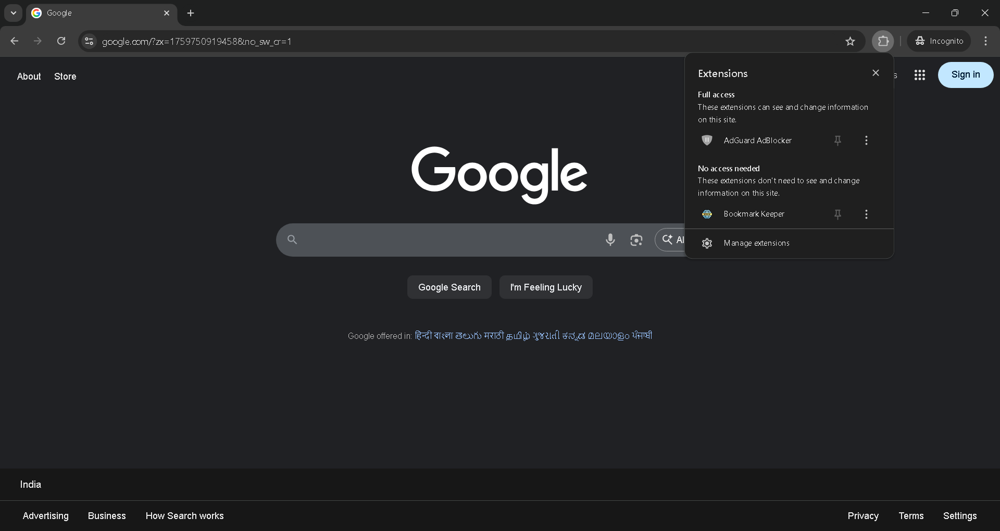
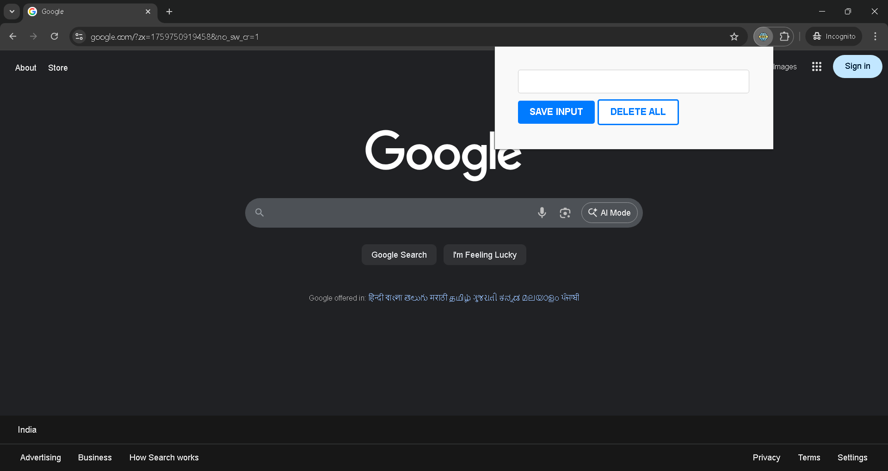
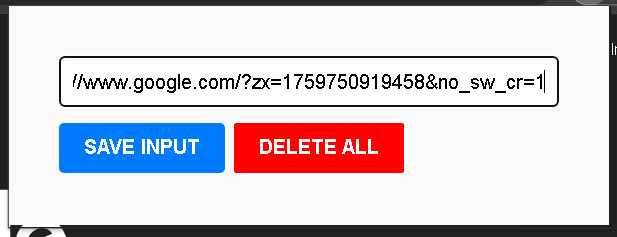
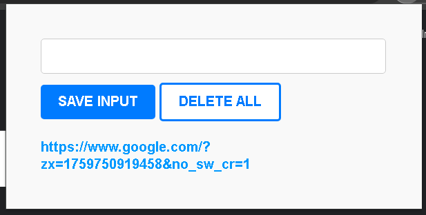

# 📌 BookmarKeeper - Save Your Bookmarks with Ease

**BookmarKeeper** is a lightweight and user-friendly browser extension that allows you to **save website links into your browser’s local storage**. Perfect for anyone who wants a simple and effective way to manage bookmarks without syncing or third-party tools.

---

## 🚀 Features

- 🔖 Add and save bookmarks instantly
- 🧹 Delete bookmarks easily
- 💾 Saves data using Local Storage (no cloud or login required)
- 🌐 Works on all Chromium-based browsers (Chrome, Brave, Edge, etc.)
- 🧩 Simple, fast, and privacy-friendly

---

## 🧩 Installation (for Chrome / Brave / Edge)

1. **Download or clone the repository:**

   ```bash
   git clone https://github.com/saurabh7121/bookMarkeeper.git

   ```

---

## 📸 **How to Use the Extension**

1. **Extension Icon Appears in the Browser**



2. **Clicking the Icon Opens the Bookmark UI**



3. **Add a Bookmark by Entering a URL and Clicking "Add"**
   

4. **View, Use, or Delete Saved Bookmarks**
   
